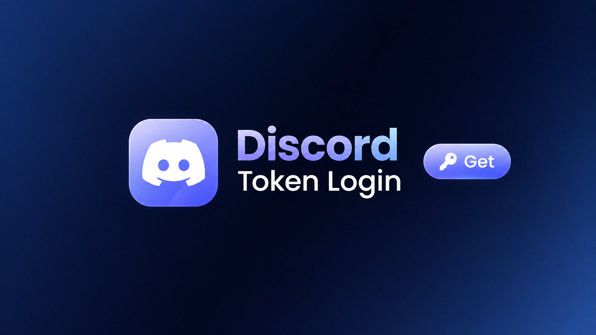
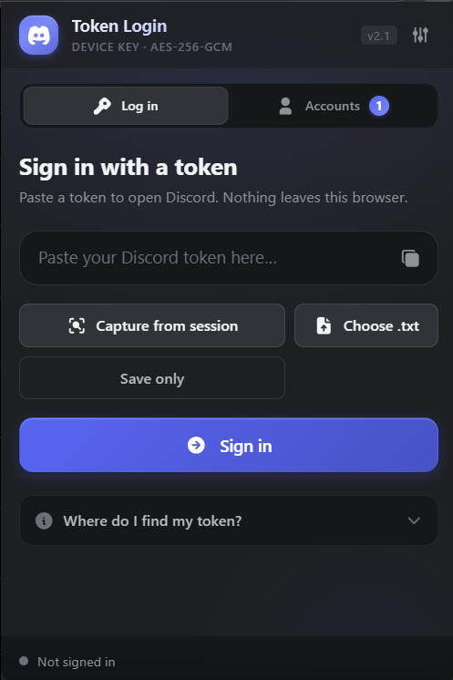
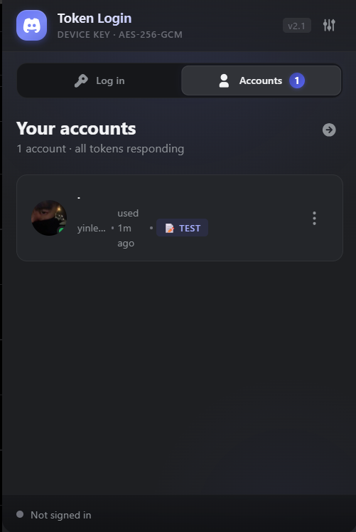
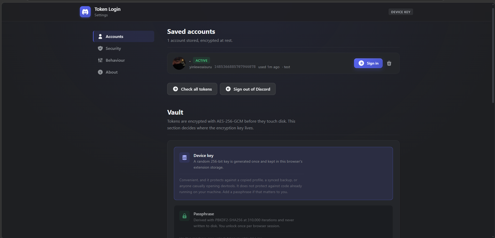

<div align="center">



# Discord Token Login

**Discord 다중 계정 관리자 및 토큰 스위처**  
*Chromium(Manifest V3) 확장 프로그램. 모든 것이 로컬에서 실행됩니다 — 분석 없음, 텔레메트리 없음, 서드파티 엔드포인트 없음.*

[](https://developer.chrome.com/docs/extensions/mv3/intro)
[](#-보안-모델)
[](#-보안-모델)
[](tsconfig.json)
[](#-개발과-품질-게이트)
[](#-개발과-품질-게이트)
[](LICENSE)

</div>

<p align="center">
  <a href="#-주요-기능">기능</a> •
  <a href="#-화면-스크린샷">스크린샷</a> •
  <a href="#-설치">설치</a> •
  <a href="#-보안-모델">보안</a> •
  <a href="#-토큰-캡처-원리">원리</a> •
  <a href="#-개발과-품질-게이트">개발</a> •
  <a href="#-스타-히스토리">스타 히스토리</a>
</p>

---

## 🌐 다국어

<p align="center">
  <a href="./README.md"></a>
  <a href="./README_VI.md"></a>
  <a href="./README_ZH.md"></a>
  <a href="./README_KO.md"></a>
  <a href="./README_JA.md"></a>
</p>

---
## 📸 화면 스크린샷

<div align="center">

### 메인 팝업 — 빠른 로그인, 계정 전환, 세션 상태



<br />

### 계정 관리 — 여러 프로필, 토큰 상태, 개인 메모



<br />

### 설정 — 암호화 모드, 패스프레이저 볼트, 캡처 동작



</div>

---

## ✨ 주요 기능

| 영역 | 설명 |
| --- | --- |
| **빠른 로그인** | 토큰을 붙여 넣고 로그인합니다. 토큰은 어딘가에 기록되기 전에 검증됩니다. |
| **토큰 캡처** | 이미 로그인된 Discord 탭에서 토큰을 직접 읽어옵니다. 손으로 복사할 필요가 없습니다. |
| **계정 관리자** | 여러 계정을 보관하고 전환하며, 로컬 메모를 달고, 어떤 토큰이 아직 유효한지 확인할 수 있습니다. |
| **암호화 저장소** | 모든 토큰은 `chrome.storage.local`에 도달하기 전에 **AES-256-GCM**으로 봉합됩니다. 선택적 패스프레이저 보호는 **PBKDF2-HMAC-SHA256**을 310,000회 반복으로 키를 파생합니다. |
| **컨텍스트 메뉴** | 툴바 아이콘을 마우스 오른쪽 클릭하면 팝업을 열지 않고도 빠른 로그인, 토큰 캡처, 설정을 실행할 수 있습니다. |
| **툴바 배지** | 아무것도 열지 않고 저장된 계정 수를 볼 수 있습니다. |
| **깔끔한 UI** | Discord 2023 팔레트를 기반으로 한 다크 테마, 빌드 시점에 번들되는 Tabler 채워진 아이콘 세트, 그리고 산발적 값이 아니라 스케일로 구성된 디자인 시스템. |

---

## 📥 설치

### 소스에서 빌드

```bash
git clone https://github.com/nguyenphanno/Extensions-Discord-Token-Login.git
cd Extensions-Discord-Token-Login
npm install          # 한 번만
npm run build        # dist/ 생성
```

### 브라우저에 불러오기

Chrome, Edge, Brave, Opera 또는 Arc에서:

1. `chrome://extensions`(또는 `edge://extensions`, `brave://extensions`)를 엽니다
2. **개발자 모드**를 켭니다(오른쪽 위 스위치)
3. **압축 해제된 확장 프로그램 불러오기**를 클릭합니다
4. `dist/` 폴더를 선택합니다

> **npm이 `install-scripts` 경고를 출력할 수 있습니다.** npm 11은 기본적으로
> 의존성 라이프사이클 스크립트를 차단합니다. esbuild는 이를 필요로 하지 않습니다 ——
> 플랫폼 바이너리는 선택적 의존성 `@esbuild/win32-x64`로 전달되므로 빌드는 정상적으로
> 동작합니다. 이 경고는 무시해도 됩니다.

### 요구 사항

| | |
| --- | --- |
| **브라우저** | Chrome / Edge / Brave / Opera / Arc 116+ (Manifest V3) |
| **Node.js** | 20 이상 (빌드와 검증 스위트용 — 확장 프로그램 자체는 런타임이 필요 없음) |
| **권한** | `storage`, `scripting`, `contextMenus`, 그리고 `https://discord.com/*` 호스트 접근 — 모두 `src/manifest.json`에 선언됨 |

---

## 🔒 보안 모델

자기 보장 범위를 과장하는 도구가 자기 한계를 인정하는 도구보다 나쁘기 때문에,
있는 그대로 적습니다.

**보장되는 것**

- 토큰은 AES-256-GCM 암호문으로 저장됩니다. 매 쓰기마다 96비트 랜덤 IV를 새로
  뽑으므로 `(키, nonce)` 쌍이 재사용되는 일은 결코 없습니다.
- **패스프레이저** 모드에서 키는 사용자의 패스프레이즈에서 파생되며 디스크에 *절대*
  기록되지 않습니다. 키는 `chrome.storage.session`에 존재하며, 이는 메모리 기반이고
  콘텐츠 스크립트에서 접근할 수 없으며, 브라우저를 닫으면 사라집니다.
- 잘못된 패스프레이즈는 변조된 레코드와 완전히 동일한 오류를 냅니다. 따라서 공격자는
  "잘못된 비밀번호"와 "손상된 데이터"를 구분할 수 없습니다.
- 보호 모드를 전환하면 모든 레코드를 다시 암호화하고, 쓰기가 실패하면 볼트를 반쪽만
  마이그레이션된 상태로 두는 대신 이전 암호문으로 되돌립니다.

**보장되지 않는 것**

- 기본값인 **기기 키** 모드에서는 키가 암호문 옆의 `chrome.storage.local`에 있습니다.
  암호화는 저장된 레코드 형식을 보호하지만, 브라우저 프로필을 복사하거나 확장 프로그램
  저장소를 읽을 수 있는 사람은 키와 암호문을 모두 가져갈 수 있습니다. **프로필에 접근할 수
  있는 코드로부터는 보호되지 않습니다**.
- 확장 프로그램이 Discord 토큰을 읽을 수 있는 이유는 그것이 바로 역할이기 때문입니다.
  자격 증명에 손댈 수 있는 다른 모든 도구와 마찬가지로 대하세요. 신뢰하는 소스에서
  설치하십시오.
- Discord의 서비스 약관도 사용자 본인의 토큰을 포함해 토큰 사용에 적용됩니다.

** 흔적을 남기나요?** 로거는 service worker 콘솔에 도달하기 전에 토큰처럼 생긴 모든
내용을 마스킹합니다. 따라서 상세 로깅을 켠다는 것이 `chrome://extensions`에 자격 증명이
유출되는 원인이 될 수는 없습니다.

### 데이터 흐름

```
토큰 입력  ──►  구조 검사  ──►  AES-256-GCM 봉합  ──►  chrome.storage.local
                                              ▲
                                              │
                        기기 키  ──────────────┤
                        PBKDF2(패스프레이즈) ───┘   (패스프레이저 모드에서는
                                                    키가 오직
                                                    chrome.storage.session에 있음)
```

### 위협 모델 요약

| 시나리오 | 기기 키 모드 | 패스프레이저 모드 |
| --- | --- | --- |
| 브라우저 프로필 탈취 | ⚠️ 키와 암호문이 함께 이동 | ✅ 디스크에는 암호문만 존재 |
| 동기화 / 백업된 프로필 | ⚠️ 두 복사본 모두 읽기 가능 | ✅ 암호문만 존재 |
| 누군가 개발자 도구를 열 때 | ⚠️ 보임 | ✅ 보이지만 패스프레이즈 없이는 무용 |
| 이미 사용자 권한으로 실행 중인 악성코드 | ❌ 방어 불가 | ❌ 방어 불가 |
| 브라우저 종료 | 키가 남음 | ✅ 키가 메모리에서 제거됨 |

---

## 🧠 토큰 캡처 원리

Discord 탭의 세션은 페이지가 소유하므로, 캡처는 `world: 'MAIN'`을 지정한
`chrome.scripting.executeScript`를 통해 — 즉 페이지 자신의 JavaScript 컨텍스트
내부에서 — 이루어집니다. 콘텐츠 스크립트는 격리된 월드에서 실행되며 페이지 저장소도,
클라이언트 모듈도 볼 수 없습니다.

Discord는 토큰을 **고정된** 저장소 키 아래 두지 않습니다. 실행 중인 클라이언트는
토큰을 메모리에 보관하고 페이지를 언로드하는 동안에만 `localStorage`로 미러링하므로,
충분히 살아 있는 세션에서 `localStorage.getItem('token')`은 빈 값을 반환합니다.
그래서 캡처는 네 개의 레이어를 순서대로 시도하고 어떤 레이어가 응답했는지 보고합니다:

1. **문서에 기록된 키** — 구형 빌드에서 바로 동작하며, 로딩이 막 끝난 페이지에서도
   유효합니다.
2. **합성 `beforeunload`** — 클라이언트 자신이 데이터를 밀어낼 때 사용하는 바로 그
   신호이므로, 실행 중인 클라이언트가 보유한 값을 공개합니다. 여기서는 아무것도
   쓰지 않습니다. 확장은 클라이언트의 벨을 누를 뿐입니다.
3. **클라이언트 자신의 `getToken()`** — 번들러의 모듈 캐시를 통해 접근하며, 콜백에
   캐시를 넘겨주는 no-op 청크를 밀어 넣어 달성합니다. 이것이 몇 시간째 열려 있는 탭에서
   동작하는 경로입니다. 토큰을 *쓰기도 할 수 있는* 모듈만 인증 저장소로 인정하며, 청크
   항목은 다시 제거되므로 페이지는 발견된 그대로 남습니다.
4. **저장소 값에 대한 제한적 스캔**으로 토큰 형태의 문자열을 찾습니다. 덕분에 토큰을 새
   키로 옮긴 빌드도 여전히 읽을 수 있습니다. *실제로* 세션 토큰인 값은 키 이름과
   상관없이 허용되고, 더 큰 덩어리 안에 묻힌 값은 키 이름이 무엇을 담는지 말해 줄 때만
   꺼내옵니다.

```
 ┌──────────────────────────────────────────────────────────┐
 │              Discord 탭에서 토큰 추출                      │
 └──────────────────────────────────────────────────────────┘
          │
          │  1. 문서에 기록된 저장소 키
          │  2. 합성 beforeunload  → 메모리 밀어내기
          │  3. 번들러 모듈 캐시    → getToken()
          │  4. 제한적 저장소 스캔  → 토큰 형태의 값
          ▼
   출처 + 구조 기준으로 후보 순위 결정
          │
          ▼
   Discord /users/@me 가 어느 것이 진짜인지 판정
```

페이지는 *제안만* 합니다. 클라이언트의 다른 모듈들은 토큰과 정확히 같은 길이와 문자
집합을 가진 문자열들을 내밉니다 — 캡차, 애널리틱스 ID, 논스 — 어떤 로컬 수단도 그것들을
실제 세션과 구분할 수 없습니다. 그래서 페이지는 모든 그럴듯한 값을 돌려주되, 어디서
왔는지와 진짜 토큰의 *구조*(첫 세그먼트를 디코딩하면 숫자 형태의 계정 ID가 되는
base64url 세그먼트들)를 갖는지를 태그로 붙입니다. 그리고 worker가 Discord에 물어
어느 것이 진짜인지 확인합니다. 후보들은 신뢰도 순으로 최대 한정된 개수까지 시도되며,
Discord가 처음 받아들인 것이 승자입니다. 오탐은 캡처 전체를 망가뜨리는 대신 요청 하나
비용으로 끝나고, 사용할 만한 것을 찾지 못하면 이제는 빈 401 대신 그 사실을 분명히
알려줍니다.

### 로그인 원리

로그인은 같은 이야기의 역방향이며, 같은 함정도 있습니다. 클라이언트는 페이지 언로드
시점에 메모리에 든 세션을 공개하므로, 단순한 저장소 쓰기는 정작 그 세션을 활성화하려고
했던 재로드에 의해 되돌려집니다. 그래서 이 쓰기는 다음을 수행합니다.

- 클라이언트가 저장하는 것과 같은 방식으로 토큰을 저장합니다 — JSON 인용 부호로,
  값이 존재하는 한 `getItem`이 바로 그것을 반환합니다.
- 찾을 수 있을 때 클라이언트 자신의 `setToken`을 호출하고, 번들이 부팅되며 모듈
  캐시가 채워질 때까지 잠시 기다립니다.
- 한 번만 실행되는 `beforeunload` 리스너를 등록해 의도한 값을 다시 확립합니다. 리스너는
  등록 순서대로 실행되므로 우리의 리스너는 클라이언트 자신의 핸들러 뒤에 실행되어 승리합니다.
  스스로 제거하므로 이후 탐색에는 영향을 주지 않습니다.

로그아웃은 같은 가드를 반대 의도로 사용하며, 그래서 로그아웃된 탭은 재로드 후에도
로그아웃 상태를 유지합니다.

> ⚠️ **본인의 계정 토큰만 캡처하십시오.** 토큰은 비밀번호입니다. 이 프로젝트는
> 독립적인 오픈소스 도구이며 Discord Inc.와 **어떤 연관, 승인, 공식 연결도 없습니다**.
> 토큰 사용 — 본인의 토큰이라 할지라도 — 은 Discord 서비스 약관의 적용을 받습니다.

---

## 📁 프로젝트 구조

```
src/
├── manifest.json          MV3 manifest
├── assets/icons/          생성된 PNG (16/32/48/128/512)
│
├── core/                  Chrome API도 DOM도 없는 순수 도메인 로직
│   ├── constants.ts       프로젝트의 모든 조정 가능한 값
│   ├── types.ts           도메인 모델 + worker 메시지 프로토콜
│   ├── logger.ts          토큰 마스킹을 갖춘 스코프 로깅
│   └── utils/             인코딩, 비동기 제어 흐름, 포맷팅
│
├── crypto/                볼트
│   ├── aes-gcm.ts         봉합 암호화
│   ├── key-derivation.ts  PBKDF2 / 기기 키
│   └── vault.ts           잠금 상태 머신, 원자적 재키화
│
├── platform/              Chrome API의 얇은 래퍼
│   ├── messaging.ts       worker로의 타입 안전 요청/응답
│   └── settings.ts        평문 환경설정
│
├── services/              애플리케이션 로직
│   ├── discord-client.ts  Discord API를 호출하는 유일한 모듈
│   ├── account-service.ts 오케스트레이션
│   ├── session-injector.ts 로그인 / 로그아웃
│   └── token-extractor.ts 살아 있는 탭에서 캡처
│
├── background/            service worker
│   ├── index.ts           리스너 배선만 담당
│   ├── router.ts          요청 → 핸들러, 절대 예외를 던지지 않음
│   ├── menu.ts            마우스 오른쪽 클릭 메뉴
│   └── badge.ts           툴바 배지
│
├── ui/                    공유, 프레임워크 없음
│   ├── icons.ts           SVG 아이콘 세트
│   ├── dom.ts             요소 헬퍼
│   ├── feedback.ts        토스트, 시트, 처리 중 상태
│   └── styles/            tokens → base → components
│
├── popup/                 380 × 600 팝업 화면
└── options/               전체 설정 탭
```

의존성 방향은 엄격히 단방향입니다: `ui → platform → services → crypto → core`.
`core/`에는 Chrome API를 import하는 것이 하나도 없으며, 이것이 보안상 중요한 코드를
격리된 상태로 테스트할 수 있게 하는 요인입니다.

---

## 🛠️ 개발과 품질 게이트

```bash
npm install

npm run typecheck      # tsc --noEmit, strict 모드
npm run lint          # 저장소 전체에 eslint + prettier 실행
npm run verify:crypto  # 실제 AES-GCM / PBKDF2 / 재키화 경로를 실행
npm run verify:api     # 토큰이 실려 나가는 요청을 단언
npm run verify:signin  # 스텁된 브라우저 API로 로그인 흐름 구동
npm run verify:extract  # 스텁된 Discord 탭으로 캡처 흐름 구동
npm run verify:format  # 순수 포맷 + CDN URL 헬퍼 검증
npm run verify:page    # 가짜 페이지로 삽입된 페이지 함수를 구동
npm run verify:docs    # README의 모든 상대 링크가 해석되는지 확인
npm run build          # 번들 + 복사 + 검증을 거쳐 dist/ 생성
npm run watch          # 증분 재빌드
npm run icons          # PNG 세트 재생성
npm run icons:preview  # icon-sheet.html에 아이콘 컨택트 시트 생성
npm run clean          # dist/ 제거
npm run pack           # 빌드 후 스토어 제출용 zip 생성
npm run verify         # 열 개 게이트를 순서대로 모두 실행
```

빌드는 manifest나 HTML이 존재하지 않는 파일을 참조하는 `dist/`를 내보내는 것을
거부합니다 — 깨진 패키지는 Chrome가 아니라 빌드를 실패시킵니다.

| 게이트 | 검사 수 | 존재하는 이유 |
| --- | --- | --- |
| `typecheck` | strict `tsc` | 타입, 죽은 import, API 표류 |
| `lint` | eslint + prettier | 사용하지 않는 코드, 정의되지 않은 전역, 스타일 드리프트 — `tsc` 혼자는 잡지 못하는 기계적 오류 |
| `verify:crypto` | 20 | 암호문이 토큰을 숨김, IV 재사용 없음, 잘못된 패스프레이즈 거부, 잠금 동작, 재키화가 손실 없이 모든 레코드를 마이그레이션 |
| `verify:api` | 18 | 토큰이 올바른 헤더로 접두사나 공백 없이 전송됨; 200/401/429 분류가 정확함 |
| `verify:signin` | 15 | 로그인이 커밋된 문서를 기다리고, 프레임 간 폴백하며, 1회 새로고침으로 복구하고, 실패 시 토큰이 아닌 탭을 보고함 |
| `verify:extract` | 11 | 캡처가 커밋된 문서를 기다리고, 만나는 실패 유형을 짚어내며, no-storage 복구에 정확히 한 번의 새로고침만 씀 |
| `verify:page` | 41 | 네 개 캡처 레이어, 후보 순위 결정, 그리고 클라이언트 자체 핸들러를 앞서는 언로드 가드 |
| `verify:format` | 23 | 아바타 + 장식 CDN URL, 토큰 목록 파싱, 스노우플레이크 디코딩과 시간 구간 |
| `verify:docs` | 6 | 다섯 README의 모든 상대 링크가 실제 파일을 가리킴 |
| `build` | manifest + HTML | 참조된 모든 파일이 `dist/`에 실제로 존재함 |

각 테스트 스위트는 실제로 잡아낸 버그가 있기 때문에 존재합니다. `verify:crypto`는 새로
만든 프로필이 기기 키를 생성하면서도 초기화 이전의 메타데이터를 계속 읽던 최초 실행
버그를 찾아냈습니다. `verify:api`는 완전히 유효한 토큰에 대해 Discord가
`401 Unauthorized`를 답하게 만들던 `Token ` 접두사를 잡아냈고, 그때 다른 모든 게이트는
초록이었습니다. `verify:page`는 Chrome의 삽입 모델을 정확히 재현합니다 — 함수의 자체
소스를 빈 realm에서 평가합니다 — 왜냐하면 캡처를 몇 달이나 망가뜨렸던 버그가, 페이지에
존재하지 않는 모듈 바인딩을 참조하며 자신의 `try/catch`에 삼켜진 삽입 함수였기
때문입니다.

---

## ❓ 자주 묻는 질문

**이게 제 계정을 훔쳐가나요?**
아니요. 서버도, 분석도 없고, `discord.com` 이외의 네트워크 호출도 없습니다.
`src/manifest.json`과 `src/services/discord-client.ts`를 직접 읽어 보세요 — 둘 다
짧고, 코드베이스 전체를 감사할 수 있습니다.

**그냥 `localStorage.getItem('token')`을 읽으면 안 되나요?**
최신 Discord는 토큰을 메모리에 보관하고 페이지를 언로드할 때만 저장소로 미러링하기
때문입니다. [토큰 캡처 원리](#-토큰-캡처-원리)를 참고하세요.

**제 계정이 만료되었다고 표시됩니다.**
Discord가 해당 세션을 무효화한 것입니다. 여전히 로그인된 탭에서 토큰을 다시 캡처해
다시 저장하십시오.

**Firefox에서도 동작하나요?**
그대로는 동작하지 않습니다. 이 확장은 Chromium MV3를 대상으로 하며 `world: 'MAIN'`
을 지정한 `chrome.scripting.executeScript`를 사용하는데, Firefox는 이를 같은 방식으로
구현하지 않습니다.

**패스프레이저 모드가 악성코드로부터 지켜주나요?**
아니요. 이미 사용자의 권한으로 실행 중인 것은 무엇이든 프로세스 메모리를 읽을 수
있습니다. 이 모드가 보호하는 것은 *저장된* 사본이며, 공유되거나 백업된 컴퓨터에서
그것이 현실적인 위험입니다.

---

## 📈 스타 히스토리

이 저장소에 스타를 찍어 응원해 주세요!

<p align="center">
  <picture>
    <source media="(prefers-color-scheme: dark)" srcset="https://api.star-history.com/svg?repos=nguyenphanno/Extensions-Discord-Token-Login&type=Date&theme=dark" />
    <source media="(prefers-color-scheme: light)" srcset="https://api.star-history.com/svg?repos=nguyenphanno/Extensions-Discord-Token-Login&type=Date" />
    
  </picture>
</p>

---

## ⚠️ 면책 조항

- 이 프로젝트는 독립적인 오픈소스 도구이며 Discord Inc.와 **어떤 연관, 제휴,
  승인, 추천도 없으며 공식적으로 연결되어 있지 않습니다**.
- "Discord" 및 Discord 로고는 Discord Inc.의 상표입니다.
- Discord 서비스 약관을 준수하면서 이 확장 프로그램을 책임 있게 사용하십시오. 인증
  토큰을 신뢰할 수 없는 상대와 절대 공유하지 마십시오.
- 작성자는 오용으로 인해 발생한 계정 손실이나 제한에 대해 책임을 지지 않습니다.

---

## 📜 라이선스

[MIT License](LICENSE)를 따릅니다. [nguyenphanno](https://github.com/nguyenphanno)가
❤️ 로 만들었습니다.

편집 중 증분 재빌드를 하려면 `npm run watch`를 사용하십시오.

